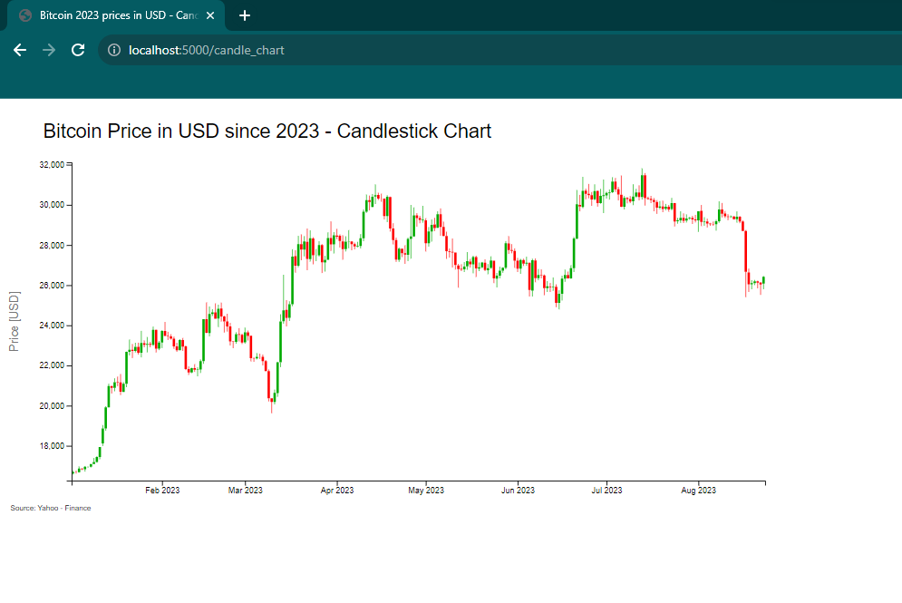

# ASK_Project

ASK subject - study course. Topic of project: Time-series database QuestDB for storing stock market data: examples,
visualization using D3.js

## How to run

### Docker

#### Build / compose questdb database - to build the vm or to restart previously stopped vm

    docker-compose up -d

#### How to stop the container - however keep the data

    docker-compose stop

#### How to delete the container

    docker-compose down

### Python - install dependencies

    python -m venv myenv
    .\myenv\Scripts\activate.bat
    pip install -r requirements.txt

### FLask app - launch app

    python -m flask run

### App website - visit website

    http://127.0.0.1:5000

## What is done

Data:

* data downloaded with prices for Bitcoin and Ethereum from [Yahoo Finance](https://finance.yahoo.com/). Yahoo finance
  deliver python lib to fetch financial data - 'yfinance'. Already downloaded csv files are in 'data' directory.

QuestDB:

* installed by Docker image. Created docker files which set up QuestDB. Access the QuestDB Web Console
  by http://localhost:9000. Questdb also could be installed natively. There is [link](https://demo.questdb.io/) to
  example demo version to get acquainted with.
* Standard ports description:
    ○ InfluxDB Line Protocol: port 9009
    ○ PostgreSQL Wire Protocol: port 8812
    ○ HTTP REST API: port 9000
    ○ Web Console: port 9000
* Data inserting
    ○ Designated timestamp is in nanoseconds
    ○ Available protocols:
        ○ InfluxDB Line Protocol (ILP) - used-  port 9000
        Python library questdb.ingress: client library implements QuestDB’s variant of the InfluxDB Line Protocol (ILP) over TCP.
        ○ PostgreSQL wire 
        ○ HTTP REST API
* Query data 
    ○ PostgreSQL wire protocol
    ○ HTTP REST API - used - port 9000

Database:

* two databases respectively for Bitcoin and Ethereum are created by code in file 'init_tables.py'. Tables are created
  by HTTP REST API and populated by InfluxDB Line Protocol. More
  information [here](https://questdb.io/docs/develop/insert-data/).

Application:

* application is written in Python language. Code is in 'app.py' file. Necessary libraries are in 'requirements.txt'
  file. Web application is written in Flask framework. Access to running app is by http://127.0.0.1:5000.

Charts:

* visualization are written by using D3.js. Scripts are in html files in 'templates' directory. Four different charts
  were created for this project.

## Results

#### Populated database

#### Welcome page

#### Area chart

#### Bar chart

#### Candle chart

#### Line chart

